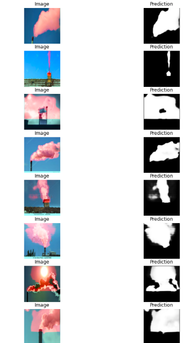

# Smoke Segmentation #  
## Approach ##  
* Smoke detection via semantic segmentation using _Baseline U-Net model_ and image augmentation in Keras
* Finding the right model and dataset
* Model Options to consider- Mask R-CNN, U-Net
* Trading off accuracy and efficiency (considering the large dataset to be used), U-Net promises a better result
* Dataset : Images and manual annotations of smoke (masks)

This repo is a partial implementation from [Kaggle](https://www.kaggle.com/kmader/baseline-u-net-model-part-1/)

The main purpose of this use-case is to detect smoke in any background. The smoke can also have variations regarding its source, color, environment etc. We should be able to semantically segment smoke to analyze it's various features like color, intensity, duration of ejection of smoke (from video feed), etc.

The master branch has implementation of **U-Net**, however another implemetation using **[LinkNet](https://arxiv.org/pdf/1707.03718.pdf)** is provided in different branch.

---
## U-Net
The U-Net is a convolutional neural network that was developed for biomedical image segmentation at the Computer Science Department of the University of Freiburg, Germany. The network is based on the fully convolutional network and its architecture was modified and extended to work with fewer training images and to yield more precise segmentations.

### _Architecture_

_Image source: Computer Science Department of the University of Freiburg, Germany_

---

In Kaggle Airbus ship detection challenge, [Kevin Mader](https://www.kaggle.com/kmader) has used this model starting with filter size 8, for detection of ships from 768x768 image. However I have used it on 'smoke images' obtained from Google search and resized them to 256x256.

---
### Images and corresponding annotations

---
### Augmented images and corresponding annotations

---
### Results

---
## Scope of improvements
- The dataset has around 400 images, adding more images to dataset can improve the accuracy
- Proper annotation of smoke also affects the prediction of the model, maybe the annotations done in the dataset can be improved and it will surely improve accuracy
- Impelementation of the original U-Net model can also improve accuracy

## Improvements 
- Collect more dataset
1. Label additional images using Labelbox  
2. Export Labelbox images as CSV/ JSON files  
3. Extract images from CSV/ JSON files  

New dataset from Labelbox is exported as labelleddata_labelbox.csv  
Extracted dataset combined with old data is in /dataset_updated
Updated file in Smoke_Segmentation.ipynb (Original Implementation : U-Net.ipynb)  
New results are in the test_predictions_updated.jpg file

## Improved Results

